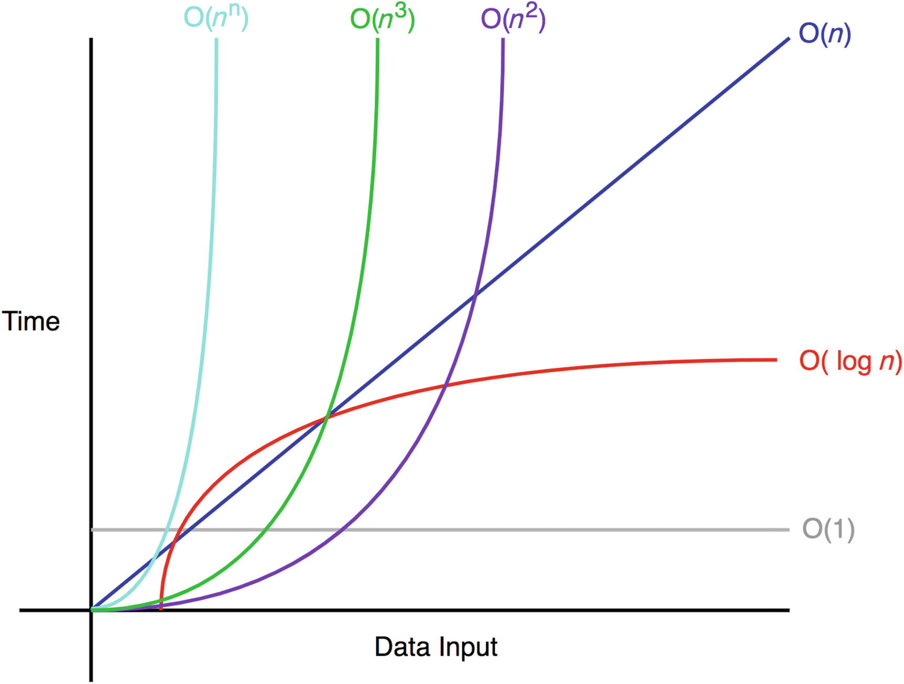

Độ phức tạp tính toán hiểu đơn giản là tổng số hoạt động cơ bản (cộng, nhân, đọc, ghi ...) được thực hiện trong quá trình tính toán, có thể được đánh trọng số tùy vào chi phí thực thi của từng hoạt động.

Đây là một khái niệm cũ [được thiết lập](http://www.cs.albany.edu/~res/comp_complexity_ams_1965.pdf) vào đầu những năm 1960s, và kể từ đó được sử dụng rộng rãi như là hàm chi phí để thiết kế thuật toán - bởi vì nó là một xấp xỉ tốt về cách máy tính hoạt động vào thời điểm đó.

### Lý thuyết độ phức tạp cổ điển

Các hoạt động cơ bản của của CPU được gọi là chỉ lệnh và chi phí trực tiếp của chúng được gọi là độ trễ. Các chỉ dẫn được lưu trữ trong bộ nhớ và được thực hiện từng cái một bởi bộ xử lý; trạng thái hoạt động được lưu trữ trong các thanh ghi. Một trong những thanh ghi này là con trỏ chỉ lệnh, cho biết địa chỉ của lệnh tiếp theo để đọc và thực hiện. Mỗi lệnh thay đổi trạng thái của bộ xử lý theo một cách nhất định (bao gồm cả việc di chuyển con trỏ lệnh), có thể sửa đổi bộ nhớ chính; và mất một số chu kỳ CPU khác nhau để hoàn thành trước khi có thể bắt đầu lệnh tiếp theo.

Để ước tính thời gian chạy thực của một chương trình, bạn cần tổng hợp tất cả độ trễ cho các lệnh được thực thi của nó và chia cho tần số đồng hồ (số chu kỳ mà một CPU cụ thể thực hiện mỗi giây).

Tần số đồng hồ là một biến số không rõ ràng phụ thuộc vào mô hình CPU, cài đặt hệ điều hành, nhiệt độ vi mạch hiện tại, mức sử dụng năng lượng của các thành phần và một vài thứ khác. Ngược lại, độ trễ lệnh là tĩnh và thậm chí có phần nhất quán trên các CPU khác nhau khi được biểu thị theo chu kỳ đồng hồ, vì vậy việc đếm chúng sẽ hữu ích hơn nhiều cho mục đích phân tích.

Ví dụ, thuật toán nhân ma trận cần tổng số $n^2 \cdot (n + n - 1)$ phép toán số học: cụ thể, $n^3$ phép nhân và $n^2 \cdot (n - 1)$ phép cộng. Nếu chúng ta tra cứu độ trễ cho các lệnh này, chúng ta có thể thấy rằng, ví dụ: phép nhân mất 3 chu kỳ, trong khi phép cộng mất 1, vì vậy chúng ta cần tổng cộng $3 \cdot n^3 + n^2 \cdot (n - 1) = 4 \cdot n^3 - n^2$ chu kỳ đồng hồ cho toàn bộ tính toán (bỏ qua hoàn toàn mọi thứ khác cần thực thi để cung cấp dữ liệu phù hợp cho các lệnh này).

Độ phức tạp tính toán có thể được sử dụng để định lượng các yêu cầu thời gian để thực thi một thuật toán, mà không cần dựa vào một máy tính cụ thể.

### Độ phức tạp tiệm cận

Ý tưởng thể hiện thời gian thực thi như một hàm của kích thước đầu là một điều hiển nhiên, nhưng nó đã không rõ ràng như vậy trong những năm 1960s. Hồi đó, [máy tính điển hình](https://en.wikipedia.org/wiki/CDC_1604) có giá hàng triệu đô la, kích thước rất lớn cần một phòng riêng để chứa, và có tần số đồng hồ đo bằng kilohertz. Chúng được sử dụng cho các nhiệm vụ hết sức thực tế, như dự đoán thời tiết, gửi tên lửa vào không gian, hoặc tìm ra khoảng cách một tên lửa hạt nhân của Liên Xô có thể bay từ bờ biển Cuba - tất cả đều là vấn đề có chiều dài hữu hạn. Các kỹ sư của thời đại đó chủ yếu quan tâm đến việc làm thế nào để nhân ma trận $3 \times 3$ chứ không phải là ma trận $n \times n$.

Máy tính liên tục trở nên nhanh hơn và dần dần, mọi người ngừng đếm thời gian thực hiện, ngừng đếm số lượng chu kỳ, và thậm chí ngừng đếm thời gian thực thi, thay thế nó bằng ước tính độ phức tạp như là một hàm của kích thước đầu vào. Với độ phức tạp tiệm cận, cách đếm "$4 \cdot n^3 - n^2$ lệnh" biến thành công thức đơn giản "$\Theta(n^3)$," giấu đi chi phí của các lệnh cụ thể cùng với các sự phức tạp khác của phần cứng bên trong ký hiệu "Big O".

Chúng ta sử dụng độ phức tạp tiệm cận vì nó cung cấp sự đơn giản trong khi vẫn đủ chính xác tương đối hữu ích về hiệu suất thuật toán trên các tập dữ liệu lớn. Với lời hứa rằng máy tính cuối cùng sẽ trở nên đủ nhanh để xử lý bất kỳ đầu vào đủ lớn nào trong một khoảng thời gian hợp lý, các thuật toán có độ phức tạp tiệm cận nhanh hơn sẽ luôn nhanh hơn trong thời gian thực.

Nhưng lời hứa này hoá ra không đúng - ít nhất là về tốc độ đồng hồ và độ trễ của lệnh - và trong chương này, chúng ta sẽ giải thích lý do tại sao và làm thế nào để xử lý nó.